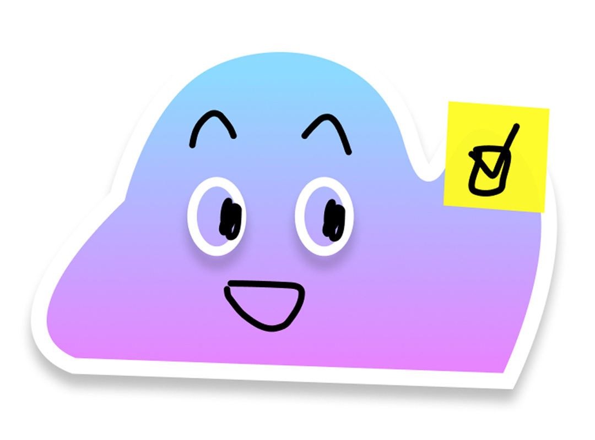

# Dask bot

Dask bot(or however you want to name it) is an open source discord bot which allows you to visualize the weather, your events saved in a google calendar and also mark your tasks in google tasks as completed for the day. It also keeps log of the tasks completed so at the end of your day, you can check out who did what at what time.  
This bot is meant to be launched and maintained by yourself for full control on what you want the bot to be. So no third party can come between your bot and your group (Except the weather and google services ofcourse).  

Reccomended for a small group of people(4-5). One google account for the groups tasks and events. To be used by a "admin" who has the role of giving tasks and managing the server.  

## What you need to get started
Python3  
A openweather account for weather forecasts : <link>https://openweathermap.org/</link>  
A google account that you intend to use for your group  
Google cloud console : <link>https://console.cloud.google.com/</link>  
Discord server  
Discord developer portal : <link>https://discord.com/developers/applications</link>  
VScode or any programming tool  
And some programming knowledge would help  

## Following will be a step by step guide to ensure you successfully get the bot to work.

### 1. Creating/Adding the bot  
 After downloading or cloning the source code in a safe proper place, you'll need to add/create the bot in discord. This guide from geeks for geeks will help you for this process. <link> https://www.geeksforgeeks.org/websites-apps/how-to-make-a-discord-bot/ </link>  
 <strong>Scroll down to the "How to create a bot using Python" part. Follow till step 4. For the 0Auth2 section, you will also want to check on, 'Send messages' and 'View channels' in 'Bot permissions'.</strong>

### 2. Adding some requirements  
Now you will open VScode or whatever software you have and open our bot folder. In the .env file you will want to add the discord token that you previously saved while creating the bot on discord.
For the weather token, log in to your openweather account(if not created, create one <link> https://home.openweathermap.org/users/sign_up </link>) > go to API keys > and copy the key in the .env  
<strong> You will also want to go the main.py file, at the bottom of the file at line 320, you're gonna want to add the channel's id where you want the bot to send a message when it's online.</strong> Generally the general channel lol. For that you want to go enable the Developper mode in your discord settings and then right click on the channel to copy id. 

### 3. GOOGLE  
This part can be a bit confusing, but stay focused folks. Here is a guide to succesfully integrate google calendar to your bot <link> https://www.onecal.io/fr/blog/how-to-integrate-google-calendar-api-into-your-app </link>.  
In step 3 you also want to enable Google tasks API cause we need it. At step 5 you're going to choose 'Desktop application' instead of 'Web application'. Give them the same name as your bot so it's not complicated later. <strong>You are also going to want to download the JSON file and save it in the .secret folder of our bot.</strong> Rename it to credentials.json. While adding the scopes to step 7, you're going to choose, 
- calendarlist.readonly
- events.public.readonly
- calendar.freebusy
- calendars.readonly
- calendar events
- calendar.events.owned.readonly
- tasks
- tasks.readonly

Everything after step 8 is not necessary, unless you're curious about it.

### 4. Final requirements  
Almost everything is setup now. You must have noticed the requirements.txt, it contains everything you need to install for the bot to run. But first, We're going to make a python's virtual environnement where the bot is going to run as a server. Be in your bot's folder and type  
`python -m venv . dvenv`  
It will create the folder for the virtual environnement. And now to launch it  
 `source dvenv/bin/activate`  
Boom, now you should be in the virtual environnement where you can safely run the server. 
Now to install the requirements.txt:  
`pip install -r requirements.txt`  
And you are now done! The bot is ready to be online !  
Start the bot  
`python3 main.py`  

There you go your bot is now online and ready to serve. Once it's started you should be able to log in to your google account, and see the bot online on your server. You can keep it running 24/7 or turn it on whenever you want, it's up to you! Add more stuff if you want, remove stuff if you want, it's all yours! 

This bot is still in early access. I'm not done yet. Gonna update it more.

<strong>PS. DON'T SHARE YOUR TOKENS WITH PEOPLE YOU DONT TRUST !!! </strong>